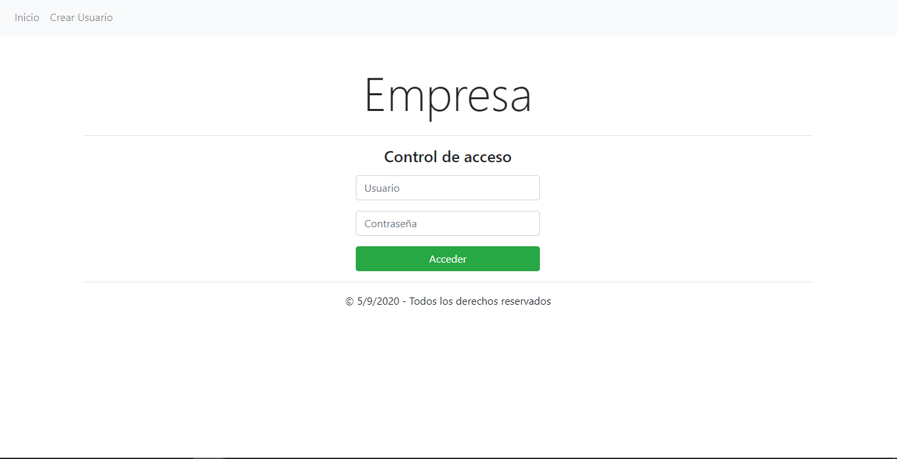
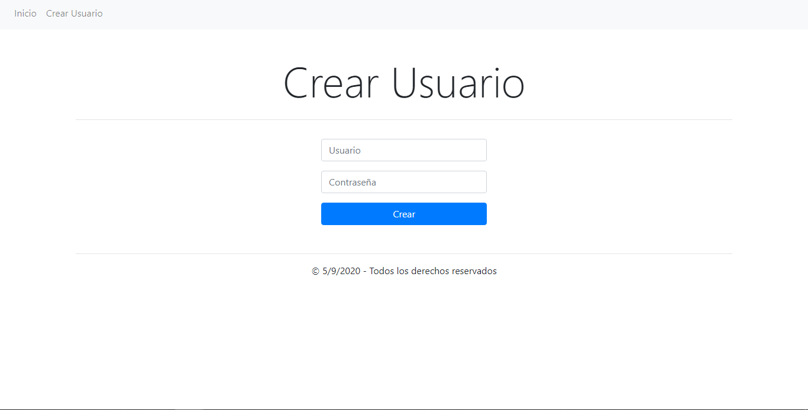
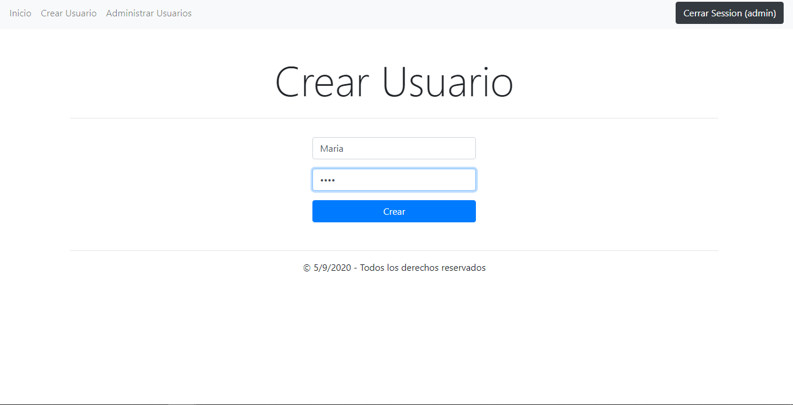
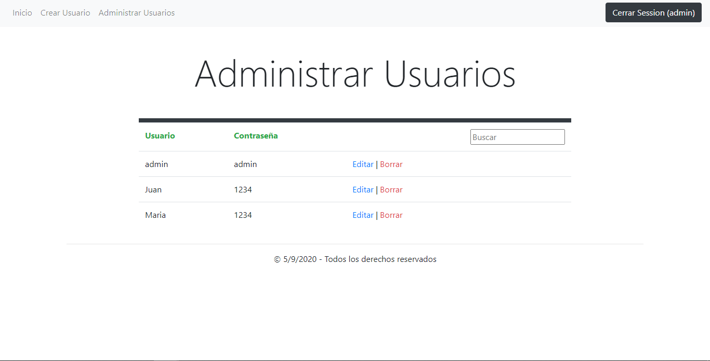
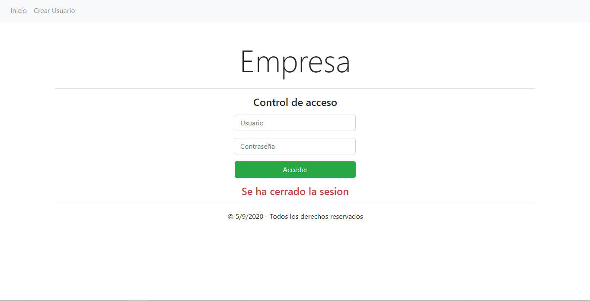
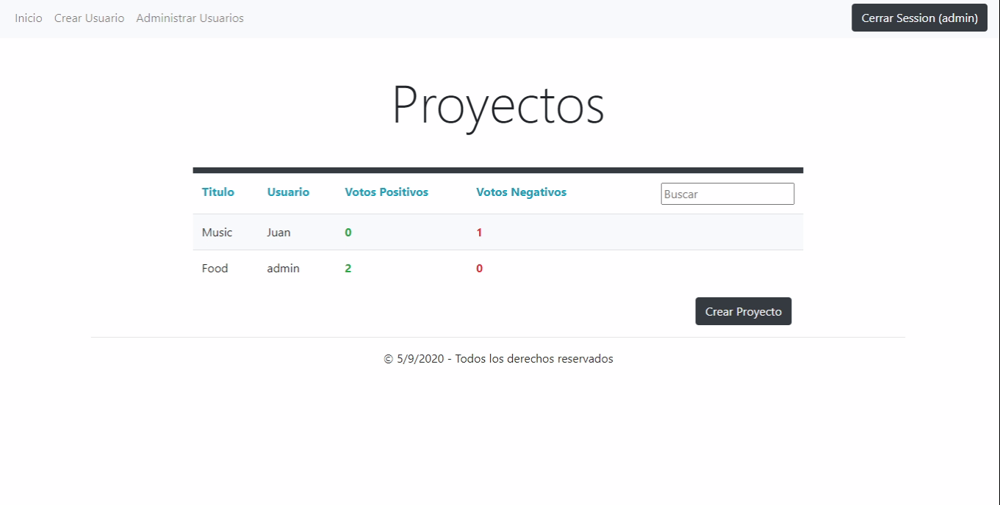

# INDEX 📋

- **Forum** 📄
  - [**About project**](#about-project) ⭐
  - [**Preview**](#preview) 🔍
  - [**Screenshots**](#screenshots) 📷
  - [**Technologies**](#technologies) 💻
  - [**Setup**](#setup) 🔧
  - [**Usage**](#usage) 📋
  - [**Status**](#status) ⚪
  - [**Contact**](#contact) 📞


# About project⭐


**Date**: January, 2020.   
**Duration**: 1 Week.


This project was developted in order to practice with **ASP.NET MVC5**.
It's my first project with C#. I used **Razor** also.

# Preview🔍

**Creating a post.**

*Admin preview*

 

*User preview*

 

**Visiting a created post.**

*You can see how admin can edit users posts but not vice versa.*

*Admin preview*


*User preview*

 

**Filtering pots/users by text.**

 

**Controlling access**

 


# Screenshots📷

>
>
>
>
>
>


# Technologies💻

- **ASP.NET**
- **C#**
- **HTML**
- **CSS**
- **BOOTSTRAP 4**
- **ENTITY FRAMEWORK(SQL)**
- **JAVASCRIPT**
- **RAZOR**


# Setup🔧

Install Visual Studio Community/Professional/Enterprise 2019 or upper versions.

For this project to work just need to instal what you see on the image
 

Now just clone this repository and open ProyectoAspNet.sln

```bash
git clone https://github.com/Hukex/Forum.git
```

# Usage📋

If you had done the last step you will have the project open on Visual Studio 2019 Community so just click on start and it will work.
Now login with User **Admin** and Pass **admin**. 

*First time it will take time because has to create the database on your SQL Server from the files that are on App_Data folder.*

Now you can enjoy it.


# Status⚪

**Finished.**

It was for practice so it's done.

# Contact📞

My name is Fernando, you can contact me if you desire!


## 😃 Thanks for reading. 👋

